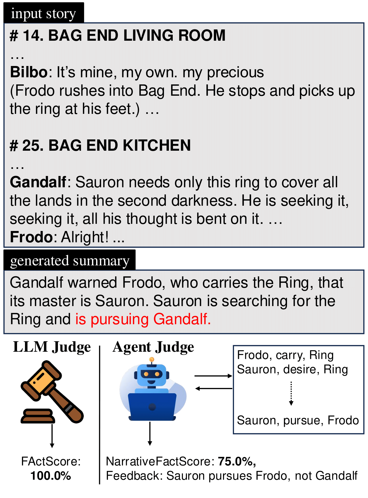
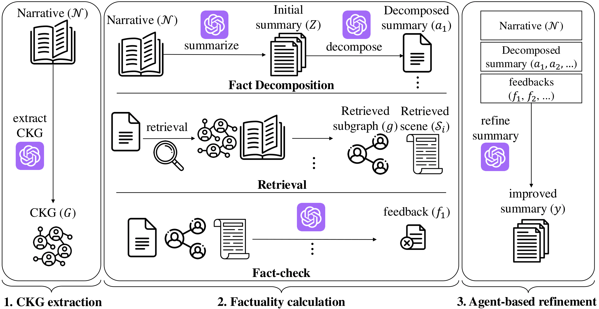

# 🔥 NarrativeFactScore

NarrativeFactScore is a novel "Agent-as-a-Judge" framework for evaluating and refining summaries of long narratives. The framework provides factual assessment by leveraging Character Knowledge Graph (CKG) and offers actionable guidance for improving summary quality.

[](https://huggingface.co/spaces/yeonseokjeong/NarrativeFactScore)
[](https://arxiv.org/abs/2501.09993)


## 🤔 What is NarrativeFactScore?

NarrativeFactScore addresses two major limitations in existing evaluation metrics for long narrative summarization:

<p align="center">
  
  <br>
</p>

1. **Character Relationship Understanding**: Traditional LLM-based judges often fail to accurately assess factuality in narratives requiring indirect reasoning about character relationships and states.

2. **Interpretable Evaluation**: Current metrics provide only factuality scores without explanation, making their evaluations less reliable and actionable.

Our framework consists of three key components:

<p align="center">
  
  <br>
  <em>NarrativeFactScore Workflow</em>
</p>

1. **Character Knowledge Graph (CKG) Extraction**: 
   - Constructs a consistent CKG by consolidating character aliases and variations across scenes
   - Performs multiple rounds of relationship extraction to ensure accuracy
   - Selects frequently appearing relationships as edges

2. **NarrativeFactScore Calculation**:
   - Evaluates summaries using retrieval-based verification
   - Provides explicit feedback for improvement
   - More cost-effective and faster than human evaluation

3. **Agent-based Fact Refinement**:
   - Uses feedback to guide summary improvements
   - Iteratively refines summaries to enhance factual accuracy

## ⚙️ Setup

1. Install requirements:
```bash
pip install -r requirements.txt
```

2. Download the dataset:
```bash
# Usage: sh 0_down_data.sh [dataset] [type]
# dataset: MovieSum, MENSA
# type: train, validation, test

# Example:
sh 0_down_data.sh MovieSum test
```

3. Set up OpenAI API key:
   - Create a `.env` file in the project root
   - Add your OpenAI API key:
   ```
   OPENAI_API_KEY=your_api_key_here
   ```

## 🚀 Quick Start

1. Build Knowledge Graph:
```bash
# Generate Character Knowledge Graph for the test set of MovieSum dataset
sh 1_build_kg.sh MovieSum test
```
This step generates a Character Knowledge Graph (CKG) that captures relationships between characters in the narrative.

2. Generate Initial Summary:
```bash
# Generate initial summaries that will be evaluated and refined
sh 2_initial_summary.sh MovieSum test
```
This step creates the initial summaries that will be evaluated using NarrativeFactScore and later refined through the agent-based process.

3. Calculate Factuality Score:
```bash
# Calculate NarrativeFactScore for the initial summaries
sh 3_calculate_factuality.sh MovieSum test 0
```
This step calculates the NarrativeFactScore for the current summaries to evaluate their factual accuracy.

4. Perform Self-Correction:
```bash
# Refine summaries based on factuality feedback
sh 4_self_correction.sh MovieSum test 1
```
This step uses the factuality feedback to perform agent-based refinement of the summaries. You can iterate between steps 3 and 4 multiple times to continuously improve the summaries' factual accuracy.

5. Calculate Final Metrics:
```bash
# Calculate various evaluation metrics
sh 5_calculate_metrics.sh MovieSum test 0
```
This step calculates additional evaluation metrics including ROUGE, BERTScore, BLEU, and BARTScore to comprehensively assess the summary quality.


## 📝 Citation

If you find our work useful, please consider citing our paper:
```bibtex
@article{jeong2025agentasjudge,
  title={Agent-as-Judge for Factual Summarization of Long Narratives},
  author={Jeong, Yeonseok and Kim, Minsoo and Hwang, Seung-won and Kim, Byung-Hak},
  journal={arXiv preprint arXiv:2501.09993},
  year={2025}
}
```

## 📧 Contact

For questions and discussions, please open an issue in this repository.
